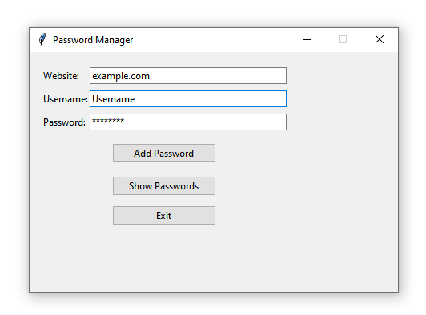

# 🔐 Password Manager (Python + Tkinter)


## About the Project

Password Manager is a small desktop application built with **Python** and **Tkinter** for storing and managing website login information locally.

The application allows users to add website usernames and passwords, view saved entries, copy passwords to the clipboard, and delete saved entries.

All data is stored locally in a CSV file, allowing the application to work completely offline.

> **Note:** This project uses simple reversible password obfuscation for educational purposes. It is **not intended for storing real or sensitive passwords** and should not be considered a secure password manager.

## Screenshots

### Main Window



## Features

* Add website login information.
* Store usernames and passwords locally.
* View saved password entries.
* Copy passwords to the clipboard.
* Delete saved entries.
* Store data in CSV format.
* Simple desktop interface using Tkinter.
* Works completely offline.
* Automatically creates the local `data/` directory.

## Technologies Used

* Python 3.7
* Tkinter
* CSV
* pathlib

## Requirements

* Python **3.7**

No external packages are required.

## Project Structure

```text
password-manager-python/
├── password_manager.py
├── screenshots/
│   └── main-window.png
├── requirements.txt
├── .gitignore
└── README.md
```

## Installation

1. Clone this repository.
2. Open a terminal in the project folder.
3. Run the application:

```bash
python password_manager.py
```

4. Enter a website, username, and password.
5. Click **Add Password** to save the entry.
6. Click **Show Passwords** to view saved entries.

## Sample Data

The application can be tested using dummy login information such as:

```text
Website: example.com
Username: testuser01@example.com
Password: TestPass123!
```

Use only fake credentials when testing or taking screenshots for the GitHub repository.

## Data Storage

Password entries are stored locally in:

```text
data/passwords.csv
```

The CSV file is intentionally excluded from Git using `.gitignore` so that stored credentials are not uploaded to GitHub.

## How It Works

The application:

1. Accepts a website, username, and password.
2. Applies simple reversible obfuscation to the password.
3. Saves the information to a local CSV file.
4. Loads saved entries when requested.
5. Decodes passwords for display or clipboard copying.
6. Allows individual entries to be deleted.

## Security Note

This project is designed as a **Python/Tkinter learning project** rather than a production security application.

The password transformation used by the application is reversible and does not provide real cryptographic protection. For a production password manager, passwords should be protected using established cryptographic techniques, secure key management, and appropriate authentication.

**Do not store real passwords in this project.**

## Future Improvements

* Replace the simple obfuscation with proper encryption.
* Add a master password.
* Add password generation.
* Add a password visibility toggle.
* Add search and filtering.
* Add categories for saved accounts.
* Add stronger validation for usernames and passwords.
* Add encrypted database storage.
* Add automatic clipboard clearing after copying.
